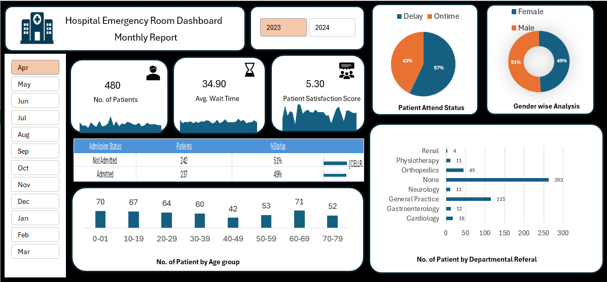

# 🚑 Hospital Emergency Room Dashboard | End-to-End Excel Project 📊

An interactive **Hospital Emergency Room Dashboard** built completely end-to-end in 
Microsoft Excel, converting raw healthcare data into clear, actionable insights.

This project helped me strengthen my practical Excel skills by working with 
real-world-style ER data and building a full analysis-to-dashboard workflow.

## Dashboard Preview

## 🔍 Key Insights from the Dashboard
✔ Patient flow trends across different months and years  
✔ Emergency room wait time patterns and their impact on patient experience  
✔ On-time vs delayed patient handling performance  
✔ Gender-wise distribution of emergency visits  
✔ Admission trends and patient outcome overview  
✔ Age-group wise patient distribution to understand demand patterns  
✔ Department referral patterns highlighting major treatment areas  

## 🛠️ Excel Skills Applied
✔ Data cleaning & structuring  
✔ Power Query for data extraction & transformation  
✔ Power Pivot for table relationships & DAX measures  
✔ Pivot Tables & Pivot Charts  
✔ Interactive slicers (Year & Month filters)  
✔ KPI cards & dynamic calculations  
✔ Data visualization best practices  
✔ Building a professional, interactive dashboard layout  
✔ End-to-end project workflow (raw data ➝ insights ➝ dashboard)  

## Tools Used
Excel, Power Query, Power Pivot, DAX, PivotTables, Slicers

## Files
- `Hospital Emergency Room Data Analysis - Excel.xlsx` — the Excel project file
